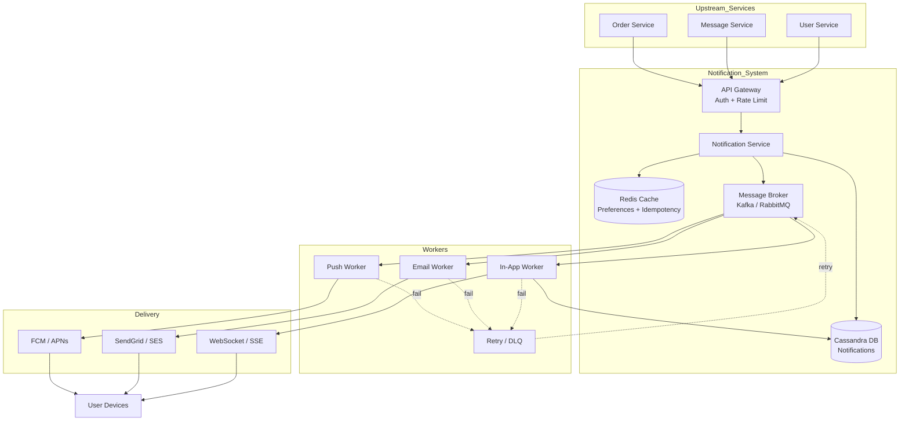

Nice, this will make your assignment look much more complete 👌
I’ll add a clean **architecture flowchart (Mermaid)** that matches your rewritten structure.

You can paste this directly into Markdown (GitHub, Notion, etc.) 👇

---

## 10. Architecture Flowchart

---

### 🔥 Small tip (for your submission)

If your teacher is strict, you can say something like:

> *“The following diagram illustrates the end-to-end data flow from event generation to final delivery across different channels.”*

---

If you want next level:

* I can convert this into a **beautiful PNG diagram**
* or make a **presentation slide version (like for defense)**
* or simplify it for explaining in 1–2 minutes 🎤
